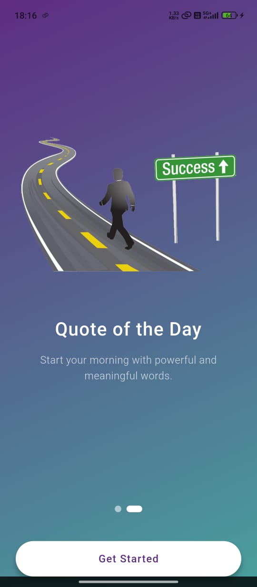
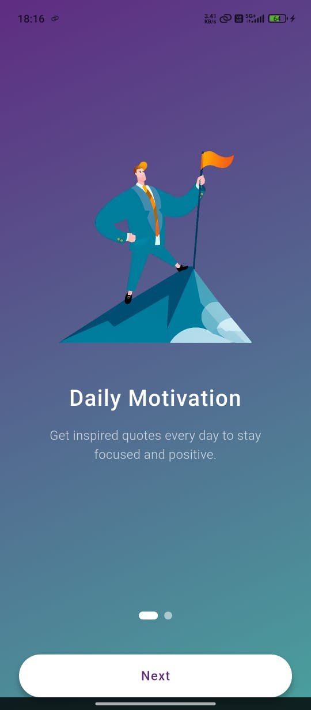
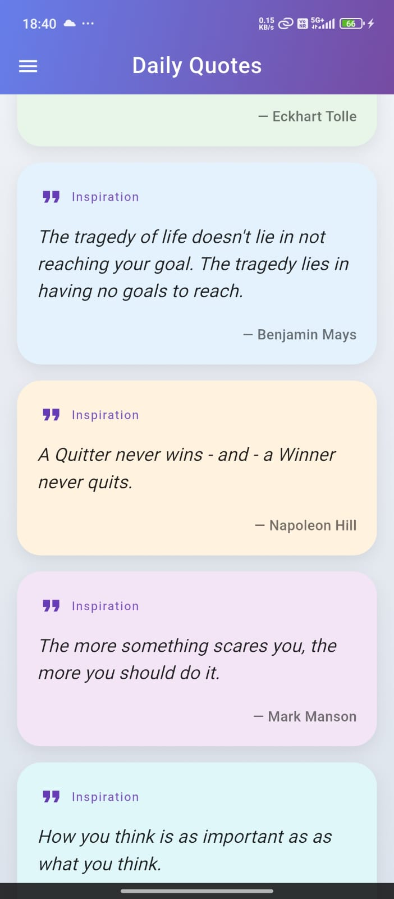
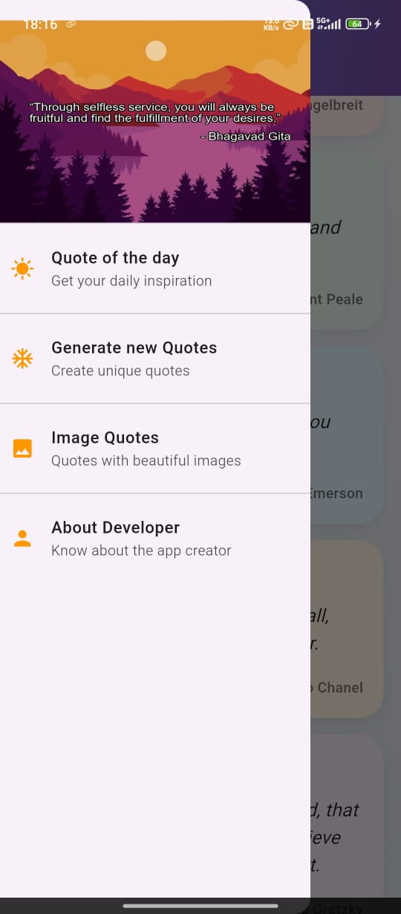
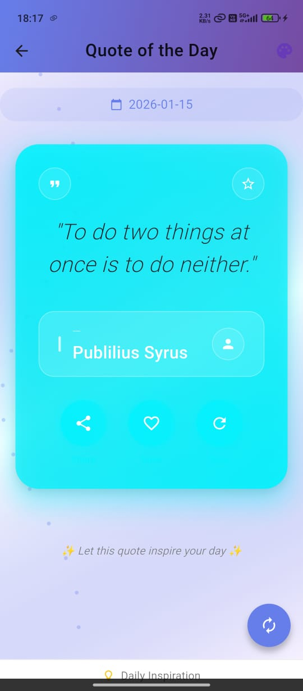
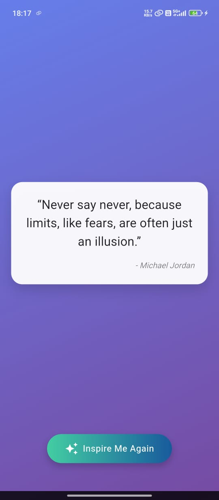
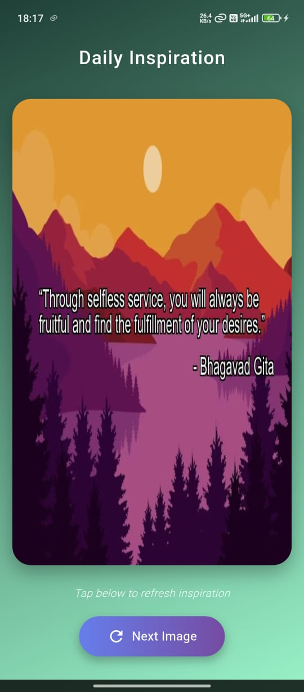

# 🌟 Daily Quotes App (Flutter)

A beautifully designed Flutter application that delivers inspirational quotes, including a Daily Quote of the Day, Random Quotes, and Image Quotes.

## 📸 App Screens

### 1. Introduction Screens

  
  

### 2. Main Screens

  
  
  

### 3. Feature Screens

  
  

## 🎥 App Demo
[Watch Video](https://github.com/vishalkd2/quote/releases/download/v1.0.0/quote.mp4)

## 📦 Download APK
[Download APK](https://github.com/vishalkd2/quote/releases/download/v1.0.0/app-release.apk)

## ✨ Features

- **Beautiful Introduction Screens** - Engaging onboarding experience
- **Home Screen** - Clean and intuitive main interface
- **Navigation Drawer** - Easy access to all features
- **Quote of the Day** - Daily inspirational quotes with notifications
- **Generate Random Quotes** - Unlimited motivation on demand
- **Generate Image Quotes** - Create beautiful quote images
- **Offline Support** - Works without internet connection
- **Share Quotes** - Share inspiration with friends
- **Save Favorites** - Bookmark your favorite quotes

## 🛠 Tech Stack
- Flutter
- Provider
- REST API (ZenQuotes)
- WorkManager
- Flutter Local Notifications
- HTTP
- SharedPreferences

## 👨‍💻 Developer
Vishal Dubey  
Flutter Developer
